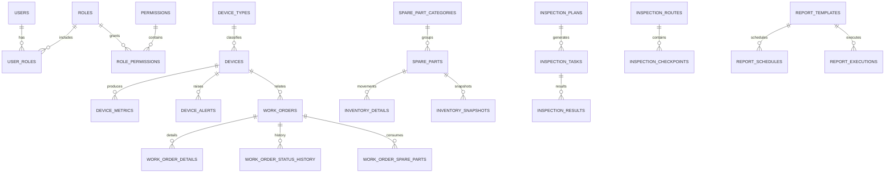

## NESOM 数据库设计总览

版本: 1.0  
日期: 2026-04-09  
作者: AI Coding Agent（基于现有概要设计补齐）  
状态: Draft  
审核状态: 待评审

## 1. 目标与范围

本目录面向 NESOM MVP 阶段的关系型数据库（MySQL 8.0）设计，覆盖以下核心业务模块的数据结构：

- 设备监控
- 工单管理
- 用户权限（认证授权 / RBAC）
- 备件管理
- 巡检管理
- 报表统计
- 系统配置（字典/参数）

说明：
- 本设计以现有概要设计文档中的数据模型为起点（见 `docs/03-概要设计/模块划分设计.md`），后续应在详细设计与评审中持续收敛。
- 设备监控的“时序数据”在 MVP 阶段可以先以关系表承载（`device_metrics`），未来可平滑迁移至时序库（如 InfluxDB）。

## 2. 设计原则与约定

### 2.1 命名规范

- **库名**：`nesom`
- **表名**：小写 + 下划线，业务表使用复数形式（例：`work_orders`）
- **字段名**：小写 + 下划线（例：`created_at`）
- **主键**：以现有详细设计为准，存在两类并存：
  - 业务主表多采用 `id VARCHAR(36)` + `UUID()`
  - 高频明细/日志类表多采用 `id BIGINT AUTO_INCREMENT`

### 2.2 通用字段（建议）

对大多数业务表建议统一以下字段（便于审计与排障）：

- `created_at`：创建时间（`DATETIME`，默认 `CURRENT_TIMESTAMP`）
- `updated_at`：更新时间（`DATETIME`，默认 `CURRENT_TIMESTAMP ON UPDATE`）
- `deleted_at`：软删除时间（可选；如启用软删除则配合索引与查询约定）
- `created_by` / `updated_by`：操作者（可选；视模块需求）

> 当前概要设计中的部分表未包含 `deleted_at`，本目录先维持与概要一致；后续评审决定是否统一引入软删除。

### 2.3 字符集与排序规则

- **字符集**：`utf8mb4`
- **排序规则**：`utf8mb4_unicode_ci`

### 2.4 索引原则

- 高频过滤字段（状态、时间、外键）必须建索引
- 避免滥用索引；以查询路径驱动索引设计
- 复合索引优先覆盖“`WHERE + ORDER BY`”组合（如 `device_id + collected_at`）

### 2.5 外键策略

MVP 阶段建议：

- 对关键关联（如工单 → 设备、库存流水 → 备件）使用外键以提高一致性
- 对高写入/高吞吐的表（如指标采集）可在后续评审中评估是否移除外键以减轻写入负担

## 3. 核心表清单（MVP）

### 3.1 设备监控

基线以 `docs/06-详细设计/01-设备监控模块/数据库设计.md` 为准，至少包括：

- `device_types`：设备类型/分类树
- `devices`：设备主数据（含 `station_id`、`device_type_id`、`parameters` 等扩展字段）
- `device_metrics`：高频指标（毫秒精度 + 分区策略）
- `device_alerts`：告警（含 `alert_code`、确认/解决状态机）
- `device_thresholds`：阈值配置（设备级/类型级/全局级）
- `device_events`：事件审计
- `device_maintenance_logs`：维护记录

### 3.2 工单管理

基线以 `docs/06-详细设计/02-工单管理模块/数据库设计.md` 为准，至少包括：

- `work_orders`：工单主表（`work_order_no`、状态机、紧急程度、站点/设备/人员冗余字段等）
- `work_order_details`：处理步骤明细
- `work_order_status_history`：状态历史
- `work_order_evaluations`：评价
- `work_order_templates`：模板
- `work_order_spare_parts`：工单备件关联

### 3.3 用户权限（RBAC）

基线以 `docs/06-详细设计/03-用户权限管理/数据库设计.md` 为准，至少包括：

- `users`：用户（含锁定/MFA/软删除等安全字段）
- `roles`：角色（类型、数据范围）
- `permissions`：权限（module/resource/action）
- `user_roles`：用户-角色
- `role_permissions`：角色-权限（支持 deny/条件）
- `departments`：组织树
- `user_sessions`：会话
- `audit_logs`：审计日志（建议分区，保留 180 天）
- `login_attempts`：登录尝试（建议分区）

### 3.4 备件管理

基线以 `docs/06-详细设计/04-备件管理模块/数据库设计.md` 为准，至少包括：

- `spare_part_categories`、`spare_parts`
- `warehouses`、`storage_locations`
- `inventory_details`、`inventory_snapshots`
- `purchase_orders`、`purchase_order_items`
- `transfer_orders`
- `inventory_orders`

### 3.5 巡检管理

基线以 `docs/06-详细设计/05-巡检管理模块/数据库设计.md` 为准，至少包括：

- `inspection_plans`
- `inspection_routes`、`inspection_checkpoints`
- `inspection_tasks`
- `inspection_results`
- `inspection_templates`、`inspection_categories`
- `inspection_schedules`

### 3.6 报表统计

基线以 `docs/06-详细设计/06-报表统计模块/数据库设计.md` 为准，至少包括：

- `report_templates`、`report_schedules`、`report_executions`
- `report_favorites`
- `data_sources`
- `statistics_cache`
- `dashboard_configs`
- 预聚合/预计算表（按需求逐步落地）：`daily_statistics_agg`、`monthly_statistics_agg`、`device_efficiency_precalc`

### 3.7 系统配置

基线以 `docs/06-详细设计/07-系统配置模块/数据库设计.md` 为准（该文档当前强调多租户 `tenant_id`），至少包括：

- `sys_config`、`sys_dict`
- `sys_approval_flow`
- `sys_notice_template`
- `sys_log_config`
- `sys_audit_log`

### 3.8 集成与运维专用数据库（建议独立库）

- **集成基线**（见 `docs/06-详细设计/08-系统集成设计/数据库设计.md`）：
  `integration_events`（建议分区）、`data_sync_records`、`api_call_logs`、`mq_status_monitor`、`data_mapping_rules`、`integration_health_status`
- **运维基线**（见 `docs/06-详细设计/09-部署运维设计/数据库设计.md`）：
  `environments`、`deployment_configs`、`deployment_history`、`monitoring_configs`、`alert_records`、`backup_policies`、`backup_records`、`recovery_records`、`operation_tickets`、`capacity_planning`、`performance_metrics` 等

## 4. ER 图（Mermaid，草案）

> 说明：该图用于快速建立关系认知，不替代表结构与约束的正式定义；以 `表结构设计.md` 为准。

## 5. 与应用层的契约（建议）

为了便于 FastAPI + SQLAlchemy 实现与 API 契约一致，建议统一：

- **时间**：统一使用 `DATETIME`（UTC 或 Asia/Shanghai 需在系统级约定）
- **状态字段**：使用 `ENUM`（MVP）或字典表（演进）；保持与前端状态枚举一致
- **幂等/唯一键**：对“编码类字段”建立唯一约束（如 `device_code`、`order_code`、`plan_code`、`task_code`、`report_code`）

## 6. 下一步（评审项）

- 确认是否引入 `deleted_at` 统一软删除
- 明确“指标采集（`device_metrics`）”的数据量预估与分区/归档策略
- 明确工单模块的“统一日志表”是否保留（`work_order_logs` vs 明细/历史拆分）
- 明确系统配置模块与权限模块的审计表是否合并、命名与ID策略是否统一
- 补齐公共主数据基线（`stations`、`tenants`、`suppliers` 等）并统一引用策略

