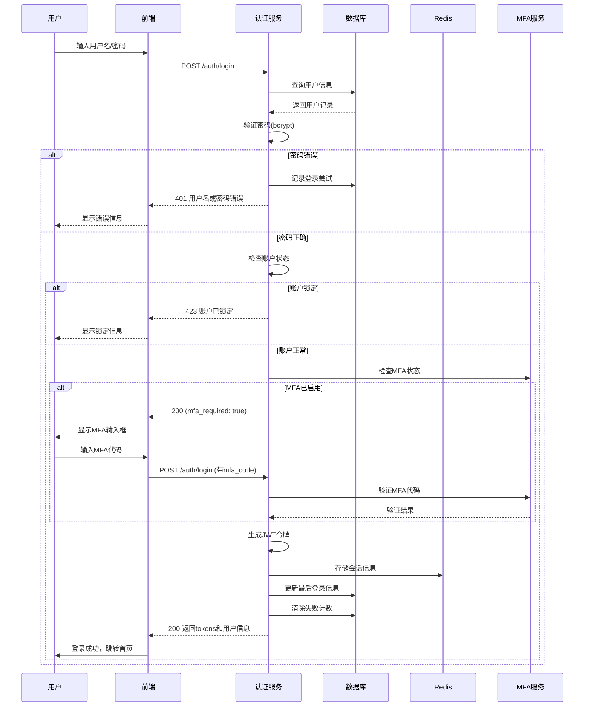
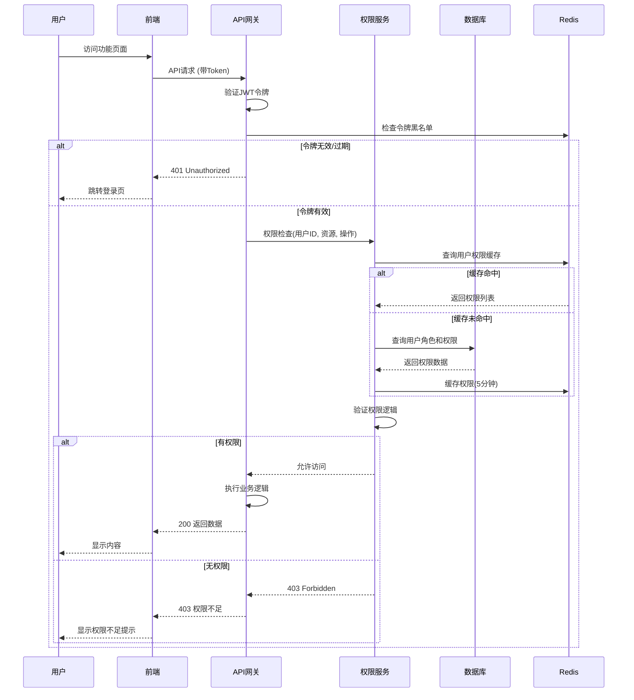

# 用户权限管理模块 - 业务逻辑详细设计

**版本**: 1.0  
**日期**: 2026-04-01  
**作者**: 高级项目经理  
**状态**: Draft  
**审核状态**: 待评审  
**继承自**: 数据库设计.md, API接口设计.md  
**相关文档**: 概要设计-模块划分设计.md

## 1. 设计概述

### 1.1 业务领域
用户权限管理模块是NESOM系统的安全核心，负责全系统的身份认证、访问控制和操作审计。主要业务领域包括：

1. **身份认证**：用户登录验证、会话管理、多因素认证
2. **访问控制**：基于角色的权限分配、数据权限隔离、操作授权
3. **用户管理**：用户生命周期管理、组织架构、账户安全
4. **审计追溯**：操作日志记录、安全事件监控、合规报告
5. **安全策略**：密码策略、会话策略、账户锁定策略

### 1.2 核心业务流程
1. 用户注册/创建 → 账户激活 → 登录认证 → 会话建立 → 权限检查 → 操作执行 → 审计记录
2. 角色定义 → 权限分配 → 用户授权 → 权限验证 → 访问控制
3. 安全事件 → 风险检测 → 响应处置 → 审计追溯 → 策略优化
4. 组织架构管理 → 部门设置 → 人员分配 → 数据权限 → 工作协同

### 1.3 设计原则
1. **安全性第一**：最小权限原则，防御纵深，安全默认
2. **性能高效**：高频认证授权操作优化，缓存合理使用
3. **易于管理**：管理员界面友好，批量操作支持
4. **合规性**：满足等保2.0三级要求，日志保留180天
5. **可扩展性**：支持多因素认证，集成外部身份源

## 2. 核心业务实体状态机

### 2.1 用户账户状态机 (User Account State Machine)

#### 2.1.1 状态定义
| 状态 | 编码 | 描述 | 业务含义 |
|------|------|------|----------|
| 待激活 | pending | 用户已创建但未激活 | 需要邮箱验证或管理员激活 |
| 活跃 | active | 账户正常可用 | 可以正常登录和操作系统 |
| 锁定 | locked | 账户被锁定 | 因安全原因暂时无法登录 |
| 停用 | inactive | 账户被管理员停用 | 长期不使用的账户，数据保留 |
| 已删除 | deleted | 账户已软删除 | 数据标记删除，可恢复 |

#### 2.1.2 状态转换规则
```
                            ┌─────────────┐
                            │   pending   │◀──────────────┐
                            └─────────────┘               │
                                   │                      │
         邮箱验证/管理员激活        │ 创建时直接激活       │
                                   ▼                      │
                            ┌─────────────┐              │
    ┌───────────────────────│   active    │──────────────┘
    │                       └─────────────┘
    │                              │
    │ 登录失败超限/管理员锁定       │ 管理员停用
    │                              ▼
    │                       ┌─────────────┐
    │                       │   locked    │
    │                       └─────────────┘
    │                              │
    │ 锁定时间到/管理员解锁         │ 管理员删除
    │                              ▼
    │                       ┌─────────────┐
    │                       │  inactive   │
    │                       └─────────────┘
    │                              │
    │ 管理员重新激活                │ 管理员删除
    │                              ▼
    └──────────────────────▶┌─────────────┐
                            │   deleted   │
                            └─────────────┘
```

#### 2.1.3 状态转换约束表
| 当前状态 | 目标状态 | 触发条件 | 前置检查 | 后置动作 |
|----------|----------|----------|----------|----------|
| pending | active | 1. 邮箱验证链接点击<br>2. 管理员手动激活 | 1. 验证链接有效<br>2. 账户未过期 | 1. 发送欢迎邮件<br>2. 记录激活时间<br>3. 分配默认角色 |
| active | locked | 1. 连续登录失败5次<br>2. 管理员手动锁定 | 1. 锁定原因明确<br>2. 非超级管理员 | 1. 记录锁定原因和时间<br>2. 撤销所有活跃会话<br>3. 发送锁定通知 |
| locked | active | 1. 锁定时间到期(30分钟)<br>2. 管理员手动解锁 | 1. 账户无其他限制 | 1. 清除失败计数<br>2. 记录解锁操作<br>3. 发送解锁通知 |
| active | inactive | 1. 管理员手动停用<br>2. 连续180天未登录 | 1. 无进行中的任务<br>2. 数据可转移 | 1. 撤销所有会话<br>2. 记录停用原因<br>3. 通知相关人员 |
| inactive | active | 1. 管理员手动激活 | 1. 账户数据完整 | 1. 记录重新激活<br>2. 发送重新激活通知 |
| any | deleted | 1. 管理员软删除 | 1. 非超级管理员<br>2. 非自己账户 | 1. 标记删除时间<br>2. 匿名化敏感数据<br>3. 记录删除操作 |

#### 2.1.4 状态转换业务规则
1. **自动转换规则**：
   - 连续登录失败5次：active → locked（自动，30分钟）
   - 连续180天未登录：active → inactive（自动，需通知）
   - 邮箱验证24小时过期：pending → deleted（自动清理）

2. **人工确认规则**：
   - locked → active：管理员需确认安全风险
   - inactive → deleted：需二次确认，数据备份
   - 超级管理员状态变更：需至少两名管理员确认

### 2.2 用户会话状态机 (User Session State Machine)

#### 2.2.1 状态定义
| 状态 | 编码 | 描述 | 业务含义 |
|------|------|------|----------|
| 活跃 | active | 会话有效且在使用中 | 可正常访问系统 |
| 空闲 | idle | 会话有效但无活动 | 即将超时，需刷新 |
| 过期 | expired | 会话已过期 | 需要重新登录 |
| 已撤销 | revoked | 会话被主动撤销 | 令牌无效，不可用 |
| 异常 | abnormal | 会话检测到异常 | 可疑活动，需验证 |

#### 2.2.2 状态转换规则
```
                            ┌─────────────┐
                            │   active    │◀──────────────────┐
                            └─────────────┘                   │
                                   │                          │
           15分钟无活动             │ 用户操作                  │
                                   ▼                          │
                            ┌─────────────┐                  │
    ┌───────────────────────│    idle     │──────────────┐   │
    │                       └─────────────┘              │   │
    │                              │                     │   │
    │ 30分钟无活动/Token过期         │ 用户操作/Token刷新    │   │
    │                              ▼                     ▼   │
    │                       ┌─────────────┐      ┌─────────────┐
    │                       │  expired    │      │  abnormal   │
    │                       └─────────────┘      └─────────────┘
    │                              │                     │
    │ 用户重新登录                  │ 管理员调查后解除       │
    │                              ▼                     │
    │                       ┌─────────────┐              │
    └──────────────────────▶│   revoked   │◀─────────────┘
                            └─────────────┘
```

#### 2.2.3 会话安全规则
1. **并发控制**：每个用户最多5个并发会话，新登录挤掉最旧会话
2. **滑动过期**：用户操作后延长会话有效期，最长24小时
3. **异常检测**：IP突变、设备指纹变更、异常操作频率触发abnormal状态
4. **全局登出**：密码修改、MFA禁用、账户锁定时撤销所有会话

## 3. 核心业务流程设计

### 3.1 用户登录认证流程

#### 3.1.1 正常登录流程


#### 3.1.2 防暴力破解机制
1. **用户级别限制**：
   - 5分钟内连续失败5次 → 锁定账户30分钟
   - 失败计数器在成功登录后清零
   - 锁定时间逐次递增（30m, 60m, 120m, 24h）

2. **IP级别限制**：
   - 1小时内同一IP失败20次 → 封锁IP 24小时
   - 支持IP白名单（管理员、受信网络）
   - 动态IP检测，防止绕过

3. **CAPTCHA触发**：
   - 同一用户连续失败3次 → 要求验证码
   - 同一IP连续失败10次 → 要求验证码
   - 验证码有效期5分钟

#### 3.1.3 MFA认证流程
1. **TOTP（基于时间的一次性密码）**：
   - 使用标准RFC6238，30秒窗口
   - 支持Google Authenticator、Microsoft Authenticator等
   - 初始设置时生成QR码和16位备份代码

2. **备份代码机制**：
   - 生成10个8位备份代码（格式：XXXX-XXXX）
   - 每个代码一次性使用，使用后失效
   - 代码加密存储，只能查看一次

3. **恢复流程**：
   - MFA设备丢失 → 使用备份代码登录 → 重新绑定MFA
   - 备份代码全部丢失 → 管理员重置 → 身份验证后重新设置

### 3.2 权限验证流程

#### 3.2.1 基于角色的访问控制（RBAC）流程


#### 3.2.2 数据权限验证流程
1. **数据权限级别**：
   - 全部数据（all）：可访问所有数据
   - 本部门数据（department）：可访问本部门及下级部门数据
   - 本人数据（self）：仅可访问自己创建的数据
   - 自定义（custom）：根据表达式动态计算

2. **数据权限实施**：
   ```python
   # 数据权限过滤器示例
   def apply_data_scope(query, user, resource_type):
       if user.is_superadmin:
           return query
       
       data_scope = user.get_max_data_scope(resource_type)
       
       if data_scope == "all":
           return query
       elif data_scope == "department":
           dept_ids = get_department_tree_ids(user.department_id)
           return query.filter(Department.id.in_(dept_ids))
       elif data_scope == "self":
           return query.filter(CreatedBy.id == user.id)
       elif data_scope == "custom":
           expression = user.get_data_scope_expression(resource_type)
           return apply_custom_filter(query, expression)
   ```

3. **权限缓存策略**：
   - 用户权限列表：Redis缓存5分钟，key=`user:perms:{user_id}`
   - 角色权限关系：Redis缓存10分钟，key=`role:perms:{role_id}`
   - 缓存失效：权限变更时主动清除相关缓存

### 3.3 用户管理流程

#### 3.3.1 用户创建流程
1. **管理员创建**：
   - 输入基本信息（用户名、邮箱、姓名、部门）
   - 选择初始角色和权限
   - 设置初始状态（active/pending）
   - 可选：发送欢迎邮件包含激活链接

2. **用户自注册**（如支持）：
   - 填写注册表单，邮箱验证
   - 状态设为pending，等待管理员审批
   - 审批通过后激活账户

3. **批量导入**：
   - 支持Excel/CSV模板导入
   - 数据验证（唯一性、格式、必填）
   - 导入结果报告（成功/失败明细）
   - 失败数据可修正后重新导入

#### 3.3.2 密码管理流程
1. **密码策略执行**：
   ```python
   class PasswordValidator:
       def validate(password, user=None):
           # 长度检查
           if len(password) < config.MIN_LENGTH:
               return False, "密码至少8位"
           
           # 复杂度检查
           if config.REQUIRE_UPPERCASE and not any(c.isupper() for c in password):
               return False, "必须包含大写字母"
           
           # 历史密码检查（避免重复）
           if user and is_password_in_history(user, password):
               return False, "不能使用最近5次用过的密码"
           
           # 密码强度评分
           score = calculate_password_strength(password)
           if score < config.MIN_SCORE:
               return False, "密码强度不足"
           
           return True, "密码有效"
   ```

2. **密码过期处理**：
   - 密码有效期90天，到期前15天开始提醒
   - 过期后强制修改密码，否则无法登录
   - 密码修改后，可选强制所有会话登出

3. **密码重置流程**：
   - 管理员重置：生成随机密码，发送通知邮件
   - 用户自助重置：通过邮箱验证，设置新密码
   - 安全要求：重置链接有效期2小时，一次性使用

### 3.4 审计日志流程

#### 3.4.1 操作审计流程
1. **审计点定义**：
   - 数据变更（CUD操作）
   - 权限变更（角色、权限分配）
   - 安全事件（登录、登出、密码修改）
   - 系统配置变更
   - 敏感操作（数据导出、批量删除）

2. **审计信息记录**：
   ```python
   class AuditLogger:
       def log_operation(user, action, resource_type, resource_id, 
                        old_value=None, new_value=None, status="success"):
           log = AuditLog(
               user_id=user.id if user else None,
               username=user.username if user else "system",
               event_type=f"{resource_type}.{action}",
               resource_type=resource_type,
               resource_id=resource_id,
               action=action,
               old_values=old_value,
               new_values=new_value,
               ip_address=request.client.host,
               user_agent=request.headers.get("user-agent"),
               status=status
           )
           
           # 异步写入，避免影响主业务性能
           audit_queue.put(log)
   ```

3. **异步处理机制**：
   - 使用消息队列（Redis Stream/RabbitMQ）缓冲日志
   - 批量写入数据库，减少IO压力
   - 失败重试机制，确保日志不丢失

#### 3.4.2 审计查询和分析
1. **查询优化**：
   - 按时间分区，按月分表
   - 建立复合索引（时间、用户、资源类型）
   - 支持复杂过滤条件组合
   - 大数据量分页查询优化

2. **安全分析**：
   - 异常登录检测：非常用IP、非常用时间、失败频率
   - 权限滥用检测：越权访问尝试、敏感操作频率
   - 数据泄露风险：批量数据导出、异常查询模式

## 4. 安全策略设计

### 4.1 密码安全策略
| 策略项 | 配置值 | 说明 |
|--------|--------|------|
| 最小长度 | 8位 | 密码至少8个字符 |
| 复杂度要求 | 大写+小写+数字 | 必须包含三种字符类型 |
| 特殊字符 | 可选 | 建议包含特殊字符增强强度 |
| 历史密码 | 5次 | 不能使用最近5次用过的密码 |
| 有效期 | 90天 | 密码90天后过期需修改 |
| 失败锁定 | 5次/30分钟 | 连续失败5次锁定30分钟 |
| 加密算法 | bcrypt | cost factor=12 |

### 4.2 会话安全策略
| 策略项 | 配置值 | 说明 |
|--------|--------|------|
| Access Token有效期 | 15分钟 | JWT短期有效，减少泄露风险 |
| Refresh Token有效期 | 7天 | 可刷新获取新Access Token |
| 并发会话数 | 5个 | 最多允许5个设备同时登录 |
| 空闲超时 | 30分钟 | 30分钟无操作需重新认证 |
| 绝对超时 | 24小时 | 即使有操作，24小时后需重新登录 |
| Token黑名单 | 支持 | 登出/密码修改后令牌加入黑名单 |

### 4.3 MFA安全策略
| 策略项 | 配置值 | 说明 |
|--------|--------|------|
| 强制启用角色 | admin, operator | 管理员和操作员必须启用MFA |
| TOTP窗口 | 30秒 | 标准TOTP时间窗口 |
| 容错窗口 | ±1个窗口 | 允许时钟偏差 |
| 备份代码数量 | 10个 | 一次性备份代码 |
| 重新绑定冷却期 | 24小时 | MFA设备丢失后24小时内不能再次重置 |

### 4.4 账户安全策略
| 策略项 | 配置值 | 说明 |
|--------|--------|------|
| 账户锁定阈值 | 5次失败 | 连续5次登录失败锁定账户 |
| 锁定持续时间 | 30分钟 | 首次锁定30分钟，逐次递增 |
| 长期未登录 | 180天 | 180天未登录自动停用 |
| 密码修改通知 | 是 | 密码修改后邮件通知 |
| 异地登录提醒 | 是 | 新IP/新设备登录邮件提醒 |

## 5. 异常处理和恢复流程

### 5.1 认证异常处理
1. **令牌过期**：
   - 前端自动尝试刷新令牌
   - 刷新失败跳转登录页
   - 保持当前页面URL，登录后返回

2. **权限不足**：
   - 显示友好错误页面，说明所需权限
   - 提供申请权限的链接或联系人
   - 记录越权访问尝试（安全审计）

3. **账户锁定**：
   - 明确显示锁定原因和剩余时间
   - 提供管理员联系方式
   - 支持自助解锁（通过邮箱验证）

### 5.2 系统故障恢复
1. **数据库故障**：
   - Redis缓存降级：权限检查使用数据库直接查询
   - 只读模式：认证服务降级为只读，允许已登录用户继续使用
   - 优雅降级：非关键功能暂时不可用

2. **Redis故障**：
   - 会话存储降级：使用数据库存储会话
   - 权限缓存失效：每次查询数据库，性能下降但功能正常
   - Token黑名单：使用数据库表管理黑名单

3. **服务雪崩防护**：
   - 限流策略：登录接口限流，防止暴力破解导致服务不可用
   - 熔断机制：依赖服务失败时快速失败，避免资源耗尽
   - 降级方案：非核心功能可关闭，保障认证核心功能

## 6. 性能优化设计

### 6.1 高频操作优化
1. **权限检查优化**：
   - 权限预加载：登录时加载用户所有权限到缓存
   - 权限缓存：Redis缓存5分钟，减少数据库查询
   - 权限位图：将权限编码为位图，快速位运算检查

2. **会话验证优化**：
   - Redis存储会话：O(1)复杂度验证
   - Token黑名单：使用Redis Set，快速判断
   - 异步会话清理：定时任务清理过期会话

3. **登录流程优化**：
   - 密码验证异步化：使用线程池，避免阻塞
   - 登录成功缓存：用户信息缓存，减少后续查询
   - 限流保护：防止大量登录请求压垮服务

### 6.2 数据库优化
1. **索引设计**：
   - 用户表：username+status复合索引（登录查询）
   - 审计表：event_time+user_id复合索引（时间范围查询）
   - 权限关联表：role_id+permission_id复合索引（权限查询）

2. **查询优化**：
   - 分页优化：使用游标分页避免OFFSET性能问题
   - 批量操作：用户权限批量查询，减少N+1查询
   - 读写分离：审计日志写入主库，查询走从库

3. **分区策略**：
   - 审计日志：按月分区，自动管理分区生命周期
   - 登录尝试：按周分区，定期清理历史数据
   - 用户会话：按过期时间分区，便于清理

## 7. 监控和告警设计

### 7.1 关键监控指标
| 指标 | 阈值 | 告警级别 | 处理措施 |
|------|------|----------|----------|
| 登录成功率 | <95% | warning | 检查认证服务、数据库 |
| 登录失败率 | >10% | warning | 检查暴力破解、账户锁定策略 |
| 权限检查延迟 | >100ms | warning | 检查Redis、数据库性能 |
| 会话创建数 | 突增50% | warning | 检查是否被攻击或业务增长 |
| 审计日志堆积 | >1000条 | warning | 检查消息队列消费者 |
| 密码重置频率 | 突增200% | critical | 检查账户安全，可能被攻击 |

### 7.2 审计报告
1. **日常安全报告**：
   - 登录统计：成功/失败次数，常见失败原因
   - 权限变更：角色/权限分配变更记录
   - 敏感操作：密码修改、账户锁定、数据导出

2. **合规性报告**：
   - 账户状态统计：活跃/锁定/停用账户数量
   - 密码过期报告：即将过期和已过期账户
   - 权限审计报告：用户权限清单，权限分配合理性

3. **安全事件报告**：
   - 异常登录检测：非常用地点、时间登录
   - 权限滥用检测：越权访问尝试
   - 账户安全事件：锁定、密码重置、MFA变更

## 8. 与其他模块集成设计

### 8.1 与设备监控模块集成
1. **设备操作权限**：
   - 设备查看权限：`device:monitor:read`
   - 设备控制权限：`device:monitor:control`
   - 设备配置权限：`device:monitor:config`

2. **设备负责人关联**：
   - 设备表responsible_person_id关联用户ID
   - 设备告警通知关联用户
   - 设备维护任务分配基于用户角色

3. **数据权限集成**：
   - 场站级数据隔离：用户只能查看所属场站设备
   - 部门级数据隔离：部门经理查看本部门所有设备
   - 个人数据隔离：普通用户只看负责的设备

### 8.2 与工单管理模块集成
1. **工单分配权限**：
   - 工单创建：`workorder:create`
   - 工单分配：`workorder:assign`
   - 工单处理：`workorder:process`
   - 工单验收：`workorder:approve`

2. **工单处理流程集成**：
   - 工单分配基于用户角色和技能标签
   - 工单通知发送给相关人员
   - 工单处理记录关联操作用户

3. **数据权限控制**：
   - 工单查看范围基于部门和组织架构
   - 敏感工单（如安全事故）额外权限控制
   - 工单数据导出权限控制

### 8.3 统一认证和授权体系
1. **统一登录入口**：
   - 所有模块共享同一登录页面
   - 统一会话管理，单点登录支持
   - 统一登出，所有模块同时登出

2. **统一权限管理**：
   - 集中式权限配置界面
   - 权限变更实时生效（缓存刷新）
   - 权限审计集中查看

3. **统一审计日志**：
   - 所有模块操作记录到统一审计表
   - 统一审计查询和分析界面
   - 统一合规性报告生成

## 9. 部署和运维考虑

### 9.1 高可用部署
1. **多实例部署**：
   - 认证服务无状态，可水平扩展
   - Redis集群保障缓存高可用
   - 数据库主从复制，读写分离

2. **容灾备份**：
   - 用户数据定期备份
   - 加密密钥安全备份
   - 审计日志异地备份

3. **灾难恢复**：
   - 数据库故障切换流程
   - Redis故障降级方案
   - 服务雪崩防护机制

### 9.2 安全加固
1. **网络层面**：
   - 认证服务内部网络隔离
   - 数据库白名单访问控制
   - Redis密码认证和网络隔离

2. **应用层面**：
   - 定期安全漏洞扫描
   - 依赖库安全更新
   - 安全配置定期审计

3. **数据层面**：
   - 敏感数据加密存储
   - 数据传输TLS加密
   - 备份数据加密保护

---

**下一步**：
1. 评审本业务逻辑设计
2. 实现核心业务逻辑代码
3. 编写单元测试和集成测试
4. 性能测试和安全测试
5. 生产环境部署和监控配置

**评审人**：后端架构师、安全专家、DBA  
**评审日期**：2026-04-02