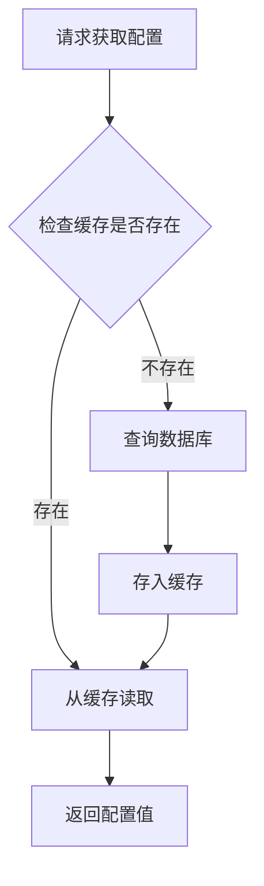
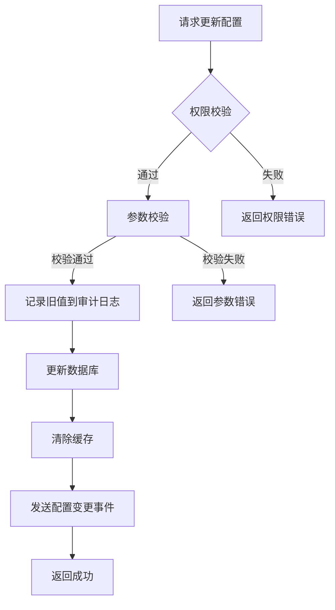
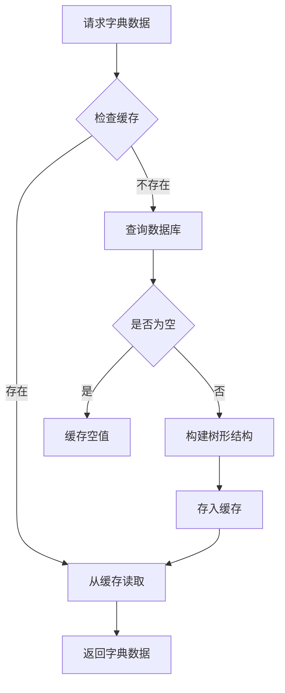
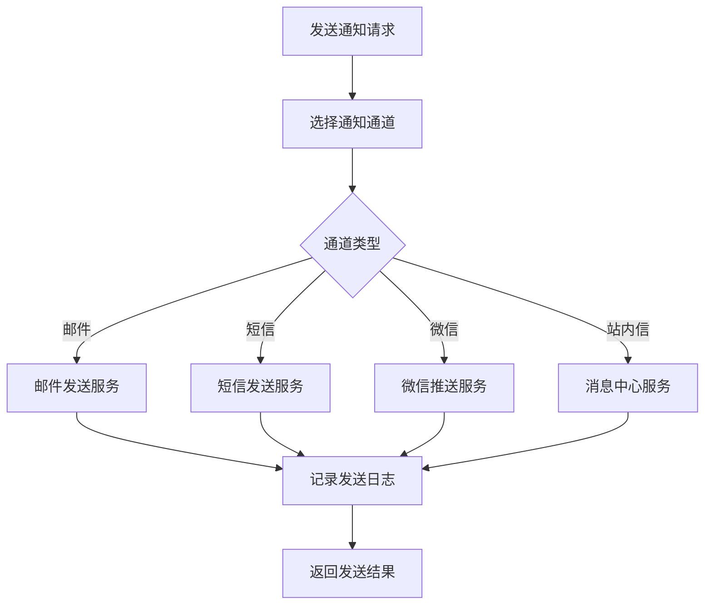
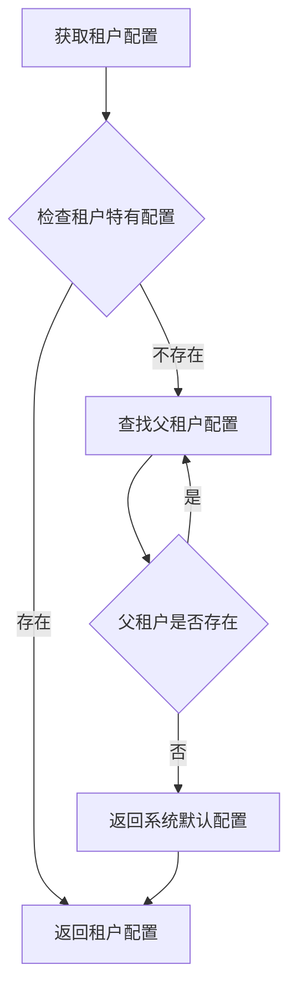

# 系统配置模块 - 业务逻辑设计

## 概述
本文档描述系统配置模块的核心业务逻辑设计，包括系统参数管理、字典数据管理、审批流程配置、通知模板管理和日志配置等功能的业务规则、流程设计和关键算法。

## 业务架构

### 1. 模块分层架构
```
┌─────────────────────────────────────────┐
│           表现层 (Presentation)         │
│  - Web API                              │
│  - 管理后台界面                         │
├─────────────────────────────────────────┤
│           业务层 (Business Logic)       │
│  - 配置管理服务                         │
│  - 字典数据服务                         │
│  - 审批流程服务                         │
│  - 通知模板服务                         │
│  - 日志配置服务                         │
├─────────────────────────────────────────┤
│           数据访问层 (Data Access)      │
│  - 数据库访问                           │
│  - 缓存访问                             │
│  - 文件存储                             │
├─────────────────────────────────────────┤
│           基础设施层 (Infrastructure)   │
│  - 数据库                               │
│  - Redis缓存                            │
│  - 消息队列                             │
│  - 文件系统                             │
└─────────────────────────────────────────┘
```

### 2. 核心服务组件
- **ConfigService**: 系统参数配置管理服务
- **DictService**: 字典数据管理服务
- **ApprovalFlowService**: 审批流程配置服务
- **NoticeTemplateService**: 通知模板管理服务
- **LogConfigService**: 日志配置服务
- **AuditService**: 审计日志服务
- **CacheService**: 缓存管理服务

## 核心业务逻辑设计

### 1. 系统参数配置管理

#### 1.1 配置读取流程


**业务规则**：
- 系统级配置（is_system=1）只能由管理员修改
- 敏感配置（is_sensitive=1）在日志和界面上需要脱敏显示
- 配置值支持多种类型：STRING、NUMBER、BOOLEAN、JSON
- JSON类型的配置值需要进行格式验证

#### 1.2 配置更新流程


**业务规则**：
- 更新系统级配置需要超级管理员权限
- 配置更新必须记录审计日志，包含旧值和新值
- 配置更新后需要立即清除相关缓存
- 重要配置变更需要发送通知给相关人员

#### 1.3 配置缓存策略
```java
public class ConfigCacheStrategy {
    // 缓存键格式：config:{tenantId}:{configKey}
    private static final String CACHE_KEY_PREFIX = "config:%s:%s";
    
    // 缓存过期时间：5分钟
    private static final long CACHE_EXPIRE_SECONDS = 300;
    
    // 缓存穿透保护：使用布隆过滤器或空值缓存
    private static final String NULL_VALUE = "__NULL__";
}
```

### 2. 字典数据管理

#### 2.1 字典数据加载流程


**业务规则**：
- 字典数据支持树形结构，通过parent_id字段实现层级关系
- 系统字典（is_system=1）不允许删除，只能禁用
- 字典编码在同一个租户和类型下必须唯一
- 字典数据变更需要同步更新所有相关缓存

#### 2.2 字典数据导入导出
**导入流程**：
1. 验证Excel文件格式和内容
2. 检查字典编码是否重复
3. 批量插入数据库（使用事务）
4. 清除相关缓存
5. 记录操作日志

**导出流程**：
1. 根据条件查询字典数据
2. 构建树形结构
3. 生成Excel文件（支持多sheet）
4. 返回文件流

### 3. 审批流程配置

#### 3.1 流程设计器业务规则
```java
public class FlowDesignRule {
    // 流程节点类型
    enum NodeType {
        START,          // 开始节点
        END,            // 结束节点
        APPROVAL,       // 审批节点
        CONDITION,      // 条件节点
        PARALLEL,       // 并行节点
        NOTICE          // 通知节点
    }
    
    // 流程验证规则
    public void validateFlow(FlowConfig config) {
        // 1. 必须有且仅有一个开始节点
        // 2. 必须有至少一个结束节点
        // 3. 节点ID必须唯一
        // 4. 审批节点必须设置审批人规则
        // 5. 不能存在孤立的节点
        // 6. 不能存在循环引用
    }
}
```

#### 3.2 流程版本管理
**版本发布流程**：
1. 草稿状态：新建的流程为草稿状态
2. 测试状态：可以进行流程测试
3. 发布状态：正式生效的版本
4. 历史状态：被新版本替换的旧版本

**版本回滚机制**：
- 支持回滚到任意历史版本
- 回滚需要管理员审批
- 回滚后需要更新缓存

#### 3.3 流程节点执行逻辑
```java
public class FlowNodeExecutor {
    public FlowResult execute(NodeContext context) {
        switch (context.getNodeType()) {
            case APPROVAL:
                return executeApprovalNode(context);
            case CONDITION:
                return executeConditionNode(context);
            case PARALLEL:
                return executeParallelNode(context);
            default:
                return FlowResult.next();
        }
    }
    
    private FlowResult executeApprovalNode(NodeContext context) {
        // 1. 根据审批人规则计算实际审批人
        // 2. 发送审批通知
        // 3. 等待审批结果
        // 4. 根据审批结果决定下一步
    }
}
```

### 4. 通知模板管理

#### 4.1 模板变量解析引擎
```java
public class TemplateEngine {
    /**
     * 解析模板变量
     * @param template 模板内容，包含{变量名}
     * @param variables 变量值映射
     * @return 解析后的内容
     */
    public String parse(String template, Map<String, Object> variables) {
        // 支持嵌套变量：{user.{field}}
        // 支持默认值：{变量名|默认值}
        // 支持条件判断：{#if 条件}内容{/if}
        // 支持循环：{#list 集合}内容{/list}
    }
}
```

#### 4.2 多通道通知发送


**业务规则**：
- 支持失败重试机制（最多3次）
- 支持发送频率限制（防止骚扰）
- 支持发送结果回调通知
- 重要通知需要确认送达

### 5. 日志配置管理

#### 5.1 动态日志级别调整
```java
public class DynamicLogLevelManager {
    /**
     * 动态调整日志级别
     * @param module 模块名称
     * @param level 日志级别
     * @param durationMinutes 持续时间（分钟）
     */
    public void adjustLogLevel(String module, LogLevel level, int durationMinutes) {
        // 1. 更新数据库配置
        // 2. 更新应用内存中的日志配置
        // 3. 设置定时任务恢复原级别
        // 4. 记录操作日志
    }
}
```

#### 5.2 审计日志记录策略
**记录时机**：
1. 数据创建、更新、删除操作
2. 重要业务操作（登录、权限变更等）
3. 系统配置变更
4. 敏感数据访问

**记录内容**：
- 操作人信息
- 操作时间
- 操作类型
- 操作对象
- 操作前后的数据变化
- 客户端信息（IP、User-Agent）

### 6. 多租户数据隔离

#### 6.1 租户数据隔离策略
```java
public class TenantDataFilter {
    // 在SQL查询中自动添加租户过滤条件
    public String addTenantFilter(String originalSql, String tenantId) {
        // 解析SQL，在WHERE条件中添加 tenant_id = ?
        // 支持复杂的SQL语句解析
    }
    
    // 在数据写入时自动设置租户ID
    public void setTenantId(Object entity, String tenantId) {
        if (entity instanceof TenantAware) {
            ((TenantAware) entity).setTenantId(tenantId);
        }
    }
}
```

#### 6.2 租户配置继承机制


## 业务规则引擎

### 1. 配置验证规则
```java
public interface ConfigValidator {
    /**
     * 验证配置值是否合法
     */
    ValidationResult validate(String configKey, String configValue, ConfigType type);
}

// 内置验证器
public class BuiltinValidators {
    // 数字范围验证器
    public static ConfigValidator numberRange(int min, int max) {
        return (key, value, type) -> {
            try {
                int num = Integer.parseInt(value);
                return num >= min && num <= max 
                    ? ValidationResult.success() 
                    : ValidationResult.failure("数值必须在" + min + "-" + max + "之间");
            } catch (NumberFormatException e) {
                return ValidationResult.failure("不是有效的数字");
            }
        };
    }
    
    // 正则表达式验证器
    public static ConfigValidator regex(String pattern, String message) {
        return (key, value, type) -> {
            return value.matches(pattern) 
                ? ValidationResult.success() 
                : ValidationResult.failure(message);
        };
    }
}
```

### 2. 审批人规则引擎
```java
public class ApproverRuleEngine {
    /**
     * 计算审批人
     * @param rule 审批人规则
     * @param context 审批上下文
     * @return 审批人列表
     */
    public List<User> calculateApprovers(ApproverRule rule, ApprovalContext context) {
        switch (rule.getType()) {
            case SPECIFIC_USER:
                return getSpecificUsers(rule.getUserIds());
            case ROLE_BASED:
                return getUsersByRole(rule.getRoleCode(), context.getDepartmentId());
            case DEPARTMENT_MANAGER:
                return getDepartmentManager(context.getDepartmentId());
            case REPORT_TO:
                return getReportToManager(context.getApplicantId());
            case FORMULA:
                return evaluateFormula(rule.getFormula(), context);
            default:
                return Collections.emptyList();
        }
    }
}
```

## 异常处理设计

### 1. 业务异常分类
```java
public enum BusinessErrorCode {
    // 配置相关错误
    CONFIG_NOT_FOUND("CONFIG_001", "配置不存在"),
    CONFIG_KEY_DUPLICATE("CONFIG_002", "配置键重复"),
    CONFIG_VALIDATION_FAILED("CONFIG_003", "配置值验证失败"),
    
    // 字典相关错误
    DICT_TYPE_EXISTS("DICT_001", "字典类型已存在"),
    DICT_CODE_DUPLICATE("DICT_002", "字典编码重复"),
    DICT_CANNOT_DELETE_SYSTEM("DICT_003", "系统字典不能删除"),
    
    // 审批流程错误
    FLOW_VALIDATION_FAILED("FLOW_001", "流程配置验证失败"),
    FLOW_VERSION_CONFLICT("FLOW_002", "流程版本冲突"),
    FLOW_CANNOT_MODIFY_ACTIVE("FLOW_003", "不能修改已激活的流程"),
    
    // 通知模板错误
    TEMPLATE_PARSE_ERROR("NOTICE_001", "模板解析失败"),
    TEMPLATE_VARIABLE_MISSING("NOTICE_002", "模板变量缺失"),
    
    // 权限错误
    PERMISSION_DENIED("AUTH_001", "权限不足"),
    TENANT_NOT_MATCH("AUTH_002", "租户不匹配")
}
```

### 2. 异常处理流程
```java
@ControllerAdvice
public class GlobalExceptionHandler {
    @ExceptionHandler(BusinessException.class)
    public ResponseEntity<ApiResponse> handleBusinessException(BusinessException e) {
        // 记录错误日志（不记录堆栈，只记录业务信息）
        log.warn("业务异常: code={}, message={}", e.getCode(), e.getMessage());
        
        // 返回标准错误响应
        return ResponseEntity.status(HttpStatus.BAD_REQUEST)
                .body(ApiResponse.error(e.getCode(), e.getMessage()));
    }
    
    @ExceptionHandler(Exception.class)
    public ResponseEntity<ApiResponse> handleSystemException(Exception e) {
        // 记录详细错误日志
        log.error("系统异常", e);
        
        // 返回通用错误响应
        return ResponseEntity.status(HttpStatus.INTERNAL_SERVER_ERROR)
                .body(ApiResponse.error("SYSTEM_ERROR", "系统内部错误"));
    }
}
```

## 性能优化策略

### 1. 缓存优化
- **一级缓存**：本地内存缓存（Caffeine），用于高频读取的配置
- **二级缓存**：分布式缓存（Redis），用于多实例共享的配置
- **缓存预热**：系统启动时加载关键配置到缓存
- **缓存穿透**：使用布隆过滤器或空值缓存

### 2. 数据库优化
- **读写分离**：查询走从库，写入走主库
- **分库分表**：按租户分库，按时间分表（审计日志）
- **索引优化**：为常用查询条件建立复合索引
- **批量操作**：批量插入、批量更新减少IO

### 3. 异步处理
- **配置变更通知**：使用消息队列异步通知其他服务
- **审计日志记录**：使用异步线程池，不阻塞主流程
- **通知发送**：使用消息队列保证最终一致性

## 监控与告警

### 1. 关键指标监控
- 配置缓存命中率
- 字典数据查询响应时间
- 审批流程执行成功率
- 通知发送成功率
- 审计日志记录量

### 2. 健康检查
- 数据库连接状态
- Redis连接状态
- 消息队列连接状态
- 线程池使用情况

### 3. 告警规则
- 配置缓存命中率低于90%
- 字典数据查询平均响应时间超过100ms
- 通知发送失败率超过5%
- 审计日志记录失败超过10条/分钟

---
*最后更新：2026-04-02*