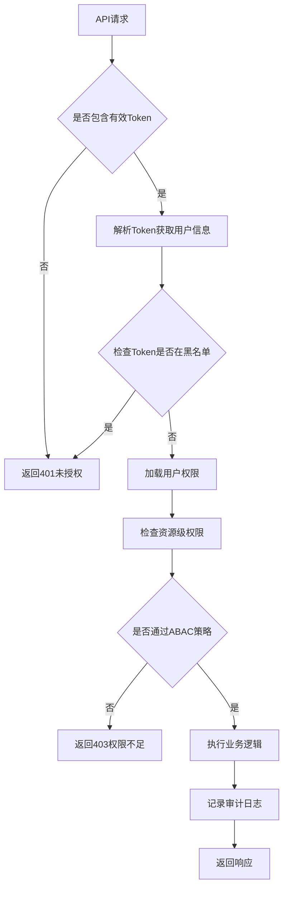
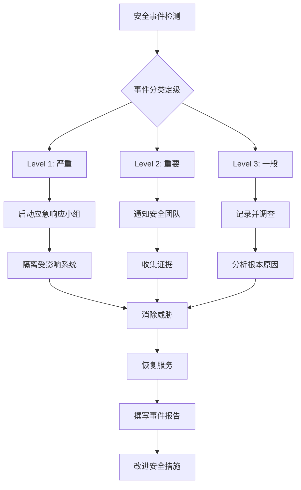

# 系统配置模块 - 安全设计

## 概述
本文档描述系统配置模块的安全设计，包括数据安全、访问控制、审计跟踪、加密传输和安全合规等方面的详细设计方案。系统配置模块作为NESOM运维管理系统的核心模块，存储了大量敏感配置信息，必须确保高级别的安全性。

## 安全设计原则

### 1. 最小权限原则
- 每个用户或服务只授予完成其任务所必需的最小权限
- 权限分配基于角色，遵循职责分离原则

### 2. 纵深防御原则
- 在系统的各个层次实施安全控制
- 不依赖单一安全机制，构建多层防御体系

### 3. 数据保护原则
- 敏感数据在存储和传输过程中必须加密
- 实施严格的数据访问控制和审计跟踪

### 4. 默认安全原则
- 系统默认配置应处于安全状态
- 新功能默认关闭，需明确启用

## 身份认证与访问控制

### 1. 认证机制设计

#### 1.1 多因素认证（MFA）
```yaml
# MFA配置策略
mfa:
  enabled: true
  required_roles: ["admin", "config_admin"]
  methods:
    - type: "totp"        # 时间型一次性密码
      issuer: "NESOM Config"
      digits: 6
      period: 30
    - type: "sms"         # 短信验证码
      provider: "aliyun"
      template_code: "SMS_123456"
    - type: "email"       # 邮件验证码
      template: "mfa_code"
```

#### 1.2 JWT令牌设计
```typescript
interface JWTClaims {
  // 标准声明
  sub: string;           // 用户ID
  iss: string;           // 签发者
  aud: string;           // 接收方
  exp: number;           // 过期时间
  iat: number;           // 签发时间
  jti: string;           // JWT ID
  
  // 自定义声明
  tenant_id: string;     // 租户ID
  roles: string[];       // 用户角色
  permissions: string[]; // 用户权限
  mfa_verified: boolean; // MFA验证状态
  session_id: string;    // 会话ID
}

// JWT安全配置
const jwtConfig = {
  algorithm: 'RS256',                    // 使用RSA非对称加密
  publicKey: process.env.JWT_PUBLIC_KEY,
  privateKey: process.env.JWT_PRIVATE_KEY,
  expiresIn: '1h',                       // 访问令牌有效期
  refreshExpiresIn: '7d',                // 刷新令牌有效期
  issuer: 'nesom-config-service',
  audience: 'nesom-client'
};
```

### 2. 访问控制模型

#### 2.1 RBAC（基于角色的访问控制）
```yaml
# 角色定义
roles:
  - name: "config_viewer"
    description: "配置查看者"
    permissions:
      - "config:system:read"
      - "config:dict:read"
      - "config:notice:read"
      
  - name: "config_editor"
    description: "配置编辑者"
    inherits: ["config_viewer"]
    permissions:
      - "config:system:write"
      - "config:dict:write"
      - "config:notice:write"
      
  - name: "config_admin"
    description: "配置管理员"
    inherits: ["config_editor"]
    permissions:
      - "config:system:delete"
      - "config:dict:delete"
      - "config:approval:manage"
      - "config:log:manage"
      - "config:audit:view"
      
  - name: "super_admin"
    description: "超级管理员"
    permissions: ["*"]  # 所有权限
```

#### 2.2 ABAC（基于属性的访问控制）
```typescript
// ABAC策略定义
interface ABACPolicy {
  id: string;
  description: string;
  effect: 'ALLOW' | 'DENY';
  conditions: Condition[];
  targets: Target[];
}

// 示例策略：只允许租户管理员修改本租户的配置
const tenantConfigPolicy: ABACPolicy = {
  id: 'policy-001',
  description: '租户配置管理策略',
  effect: 'ALLOW',
  conditions: [
    {
      attribute: 'user.tenant_id',
      operator: 'EQUALS',
      value: 'resource.tenant_id'
    },
    {
      attribute: 'user.roles',
      operator: 'CONTAINS',
      value: 'tenant_admin'
    },
    {
      attribute: 'action',
      operator: 'IN',
      value: ['config:system:write', 'config:dict:write']
    }
  ],
  targets: ['sys_config', 'sys_dict']
};
```

#### 2.3 权限验证流程


## 数据安全设计

### 1. 敏感数据保护

#### 1.1 数据分类分级
```yaml
# 数据分类分级策略
data_classification:
  levels:
    - level: "L4 - 公开"
      description: "可公开访问的数据"
      examples: ["系统版本号", "帮助文档"]
      protection: "无特殊保护"
      
    - level: "L3 - 内部"
      description: "内部使用的非敏感数据"
      examples: ["一般配置参数", "字典数据"]
      protection: "基础访问控制"
      
    - level: "L2 - 敏感"
      description: "敏感业务数据"
      examples: ["用户信息", "业务配置"]
      protection: "加密存储、严格访问控制"
      
    - level: "L1 - 高度敏感"
      description: "高度敏感的核心数据"
      examples: ["密码密钥", "审计日志", "系统密钥"]
      protection: "强加密、最小权限、详细审计"
```

#### 1.2 数据加密方案

**1.2.1 存储层加密**
```java
public class DataEncryptionService {
    // 使用AES-GCM进行数据加密
    private static final String ENCRYPTION_ALGORITHM = "AES/GCM/NoPadding";
    private static final int AES_KEY_SIZE = 256;
    private static final int GCM_TAG_LENGTH = 128;
    private static final int GCM_IV_LENGTH = 12;
    
    /**
     * 加密敏感数据
     */
    public EncryptedData encrypt(String plaintext, String keyId) {
        // 1. 从密钥管理系统获取加密密钥
        SecretKey key = keyManagementService.getKey(keyId);
        
        // 2. 生成随机IV
        byte[] iv = generateRandomIV();
        
        // 3. 加密数据
        Cipher cipher = Cipher.getInstance(ENCRYPTION_ALGORITHM);
        GCMParameterSpec spec = new GCMParameterSpec(GCM_TAG_LENGTH, iv);
        cipher.init(Cipher.ENCRYPT_MODE, key, spec);
        
        byte[] ciphertext = cipher.doFinal(plaintext.getBytes(StandardCharsets.UTF_8));
        
        // 4. 返回加密数据（包含IV和密钥ID）
        return new EncryptedData(
            Base64.getEncoder().encodeToString(ciphertext),
            Base64.getEncoder().encodeToString(iv),
            keyId,
            System.currentTimeMillis()
        );
    }
    
    /**
     * 数据脱敏显示
     */
    public String maskSensitiveData(String data, DataClassification classification) {
        switch (classification.getLevel()) {
            case "L1":
                return "***";  // 完全隐藏
            case "L2":
                return maskMiddle(data, 3, 3);  // 隐藏中间部分
            default:
                return data;  // 不脱敏
        }
    }
}
```

**1.2.2 传输层加密**
- 所有API通信使用TLS 1.3
- 强制HTTPS，禁用HTTP
- 使用强密码套件：TLS_AES_256_GCM_SHA384
- 证书使用ECC算法（P-256）

#### 1.3 密钥管理
```yaml
# 密钥管理策略
key_management:
  # 主密钥（Key Encryption Key）
  kek:
    provider: "aws-kms"  # 使用云服务商KMS
    key_id: "alias/nesom-config-kek"
    rotation_period: "90d"  # 90天轮换一次
    
  # 数据密钥（Data Encryption Key）
  dek:
    generation: "per_tenant"  # 每个租户独立的数据密钥
    storage: "encrypted_with_kek"  # 使用KEK加密后存储
    rotation_period: "30d"  # 30天轮换一次
    
  # 密钥访问控制
  access_control:
    - role: "key_admin"
      actions: ["create", "rotate", "disable"]
    - role: "service_account"
      actions: ["encrypt", "decrypt"]
```

### 2. 数据库安全

#### 2.1 数据库访问控制
```sql
-- 创建最小权限的数据库用户
CREATE USER 'nesom_config'@'%' IDENTIFIED BY '强密码123!@#';
GRANT SELECT, INSERT, UPDATE, DELETE ON nesom_config.* TO 'nesom_config'@'%';

-- 敏感表额外权限控制
GRANT SELECT ON nesom_config.sys_audit_log TO 'audit_viewer'@'localhost';
GRANT SELECT ON nesom_config.sys_config TO 'config_viewer'@'应用服务器IP';

-- 禁止直接删除数据的权限
REVOKE DELETE ON nesom_config.* FROM 'nesom_config'@'%';
```

#### 2.2 数据脱敏视图
```sql
-- 创建脱敏视图供普通用户查询
CREATE VIEW vw_sys_config_masked AS
SELECT 
    id,
    tenant_id,
    config_key,
    CASE 
        WHEN is_sensitive = 1 THEN '***'
        ELSE config_value 
    END as config_value,
    config_type,
    module,
    description,
    is_sensitive,
    is_system,
    created_time,
    updated_time
FROM sys_config;
```

#### 2.3 数据库审计
```sql
-- 启用MySQL审计日志
SET GLOBAL audit_log_format = 'JSON';
SET GLOBAL audit_log_policy = 'ALL';
SET GLOBAL audit_log_rotate_on_size = 100000000;  -- 100MB
SET GLOBAL audit_log_rotations = 10;  -- 保留10个文件
```

## 应用层安全设计

### 1. 输入验证与净化

#### 1.1 配置值验证
```java
public class ConfigValidator {
    // 内置验证规则
    private static final Map<String, Validator> BUILTIN_VALIDATORS = Map.of(
        "email", new EmailValidator(),
        "url", new UrlValidator(),
        "ip", new IpAddressValidator(),
        "json", new JsonSchemaValidator(),
        "regex", new RegexValidator()
    );
    
    /**
     * 验证配置值
     */
    public ValidationResult validate(ConfigItem config) {
        // 1. 基础类型验证
        if (!validateType(config)) {
            return ValidationResult.failure("配置类型不匹配");
        }
        
        // 2. 业务规则验证
        if (config.getValidationRule() != null) {
            Validator validator = BUILTIN_VALIDATORS.get(config.getValidationRule());
            if (validator != null && !validator.validate(config.getValue())) {
                return ValidationResult.failure("配置值不符合业务规则");
            }
        }
        
        // 3. 安全规则验证（防注入）
        if (containsInjection(config.getValue())) {
            return ValidationResult.failure("配置值包含潜在的安全风险");
        }
        
        return ValidationResult.success();
    }
    
    /**
     * 检测注入攻击
     */
    private boolean containsInjection(String value) {
        // SQL注入检测
        if (SQL_INJECTION_PATTERN.matcher(value).find()) {
            return true;
        }
        
        // XSS攻击检测
        if (XSS_PATTERN.matcher(value).find()) {
            return true;
        }
        
        // 命令注入检测
        if (COMMAND_INJECTION_PATTERN.matcher(value).find()) {
            return true;
        }
        
        return false;
    }
}
```

#### 1.2 参数绑定保护
```java
@RestController
public class ConfigController {
    /**
     * 安全的参数绑定（使用DTO而不是Map）
     */
    @PostMapping("/configs")
    public ResponseEntity<?> createConfig(
        @Valid @RequestBody CreateConfigRequest request,  // 使用明确的DTO
        BindingResult bindingResult
    ) {
        if (bindingResult.hasErrors()) {
            // 返回详细的参数错误信息
            return ResponseEntity.badRequest()
                .body(bindingResult.getAllErrors());
        }
        
        // 业务处理
        return ResponseEntity.ok(configService.createConfig(request));
    }
    
    /**
     * 不安全的参数绑定（避免使用）
     */
    @Deprecated
    @PostMapping("/configs/unsafe")
    public ResponseEntity<?> createConfigUnsafe(
        @RequestBody Map<String, Object> params  // 危险：可能包含任意字段
    ) {
        // 可能被注入恶意字段
        return ResponseEntity.ok("不安全的方法");
    }
}
```

### 2. 会话安全管理

#### 2.1 会话固定攻击防护
```java
public class SessionSecurityFilter extends OncePerRequestFilter {
    @Override
    protected void doFilterInternal(HttpServletRequest request, 
                                  HttpServletResponse response, 
                                  FilterChain chain) throws IOException, ServletException {
        
        HttpSession session = request.getSession(false);
        
        // 防止会话固定攻击：登录后创建新会话
        if (isLoginRequest(request) && session != null) {
            session.invalidate();  // 使旧会话失效
            session = request.getSession(true);  // 创建新会话
            
            // 设置会话属性
            session.setAttribute("created", System.currentTimeMillis());
            session.setAttribute("ip", request.getRemoteAddr());
            session.setAttribute("userAgent", request.getHeader("User-Agent"));
        }
        
        // 检查会话劫持
        if (session != null && isSessionHijacked(session, request)) {
            session.invalidate();
            response.sendRedirect("/login?error=session_hijacked");
            return;
        }
        
        chain.doFilter(request, response);
    }
    
    private boolean isSessionHijacked(HttpSession session, HttpServletRequest request) {
        String sessionIp = (String) session.getAttribute("ip");
        String sessionUserAgent = (String) session.getAttribute("userAgent");
        
        return !Objects.equals(sessionIp, request.getRemoteAddr()) ||
               !Objects.equals(sessionUserAgent, request.getHeader("User-Agent"));
    }
}
```

#### 2.2 并发会话控制
```yaml
# 会话管理配置
session:
  max_sessions_per_user: 3           # 每个用户最多3个并发会话
  timeout: 1800                      # 会话超时时间（秒）
  cookie:
    http_only: true                  # 防止XSS读取cookie
    secure: true                     # 仅HTTPS传输
    same_site: "strict"              # 防止CSRF攻击
    path: "/api"
    domain: ".nesom.com"
```

### 3. API安全防护

#### 3.1 速率限制
```java
@Configuration
public class RateLimitConfig {
    @Bean
    public FilterRegistrationBean<RateLimitFilter> rateLimitFilter() {
        FilterRegistrationBean<RateLimitFilter> registration = new FilterRegistrationBean<>();
        registration.setFilter(new RateLimitFilter());
        registration.addUrlPatterns("/api/v1/configs/*", "/api/v1/dict/*");
        registration.setOrder(1);
        return registration;
    }
}

public class RateLimitFilter implements Filter {
    // 使用令牌桶算法进行限流
    private final RateLimiter rateLimiter = RateLimiter.create(100.0);  // 100请求/秒
    
    @Override
    public void doFilter(ServletRequest request, ServletResponse response, FilterChain chain) 
            throws IOException, ServletException {
        
        HttpServletRequest httpRequest = (HttpServletRequest) request;
        String clientId = getClientIdentifier(httpRequest);
        
        // 根据不同客户端设置不同限流策略
        double permitsPerSecond = getRateLimitForClient(clientId);
        
        if (!rateLimiter.tryAcquire()) {
            HttpServletResponse httpResponse = (HttpServletResponse) response;
            httpResponse.setStatus(429);  // Too Many Requests
            httpResponse.getWriter().write("{\"error\":\"rate_limit_exceeded\"}");
            return;
        }
        
        chain.doFilter(request, response);
    }
}
```

#### 3.2 API密钥管理
```java
public class ApiKeyAuthenticationProvider implements AuthenticationProvider {
    private final ApiKeyService apiKeyService;
    
    @Override
    public Authentication authenticate(Authentication authentication) throws AuthenticationException {
        String apiKey = (String) authentication.getCredentials();
        
        // 验证API密钥
        ApiKeyInfo apiKeyInfo = apiKeyService.validateApiKey(apiKey);
        if (apiKeyInfo == null) {
            throw new BadCredentialsException("Invalid API key");
        }
        
        // 检查密钥是否过期
        if (apiKeyInfo.isExpired()) {
            throw new CredentialsExpiredException("API key expired");
        }
        
        // 检查密钥是否被撤销
        if (apiKeyInfo.isRevoked()) {
            throw new DisabledException("API key revoked");
        }
        
        // 记录使用日志
        apiKeyService.logUsage(apiKeyInfo, getClientInfo());
        
        return new ApiKeyAuthenticationToken(apiKeyInfo, apiKey, apiKeyInfo.getAuthorities());
    }
}
```

## 审计与监控

### 1. 安全审计日志

#### 1.1 审计事件分类
```yaml
# 审计事件配置
audit_events:
  # 认证相关事件
  authentication:
    - "LOGIN_SUCCESS"
    - "LOGIN_FAILURE"
    - "LOGOUT"
    - "MFA_ENABLED"
    - "MFA_DISABLED"
    - "PASSWORD_CHANGED"
    
  # 授权相关事件
  authorization:
    - "PERMISSION_GRANTED"
    - "PERMISSION_REVOKED"
    - "ROLE_ASSIGNED"
    - "ROLE_REMOVED"
    - "ACCESS_DENIED"
    
  # 配置相关事件
  configuration:
    - "CONFIG_CREATED"
    - "CONFIG_UPDATED"
    - "CONFIG_DELETED"
    - "CONFIG_EXPORTED"
    - "CONFIG_IMPORTED"
    
  # 系统事件
  system:
    - "BACKUP_STARTED"
    - "BACKUP_COMPLETED"
    - "RESTORE_STARTED"
    - "RESTORE_COMPLETED"
    - "KEY_ROTATED"
```

#### 1.2 审计日志格式
```json
{
  "event_id": "audit-20240402-001",
  "event_type": "CONFIG_UPDATED",
  "timestamp": "2026-04-02T10:30:00Z",
  "user": {
    "id": "user-123",
    "username": "admin",
    "ip_address": "192.168.1.100",
    "user_agent": "Mozilla/5.0 (Windows NT 10.0; Win64; x64) AppleWebKit/537.36"
  },
  "resource": {
    "type": "sys_config",
    "id": "config-456",
    "name": "system.timeout"
  },
  "action": "UPDATE",
  "details": {
    "old_value": "30",
    "new_value": "60",
    "changed_fields": ["config_value"],
    "reason": "性能优化调整"
  },
  "outcome": "SUCCESS",
  "severity": "MEDIUM",
  "tenant_id": "tenant-789"
}
```

### 2. 安全监控告警

#### 2.1 监控指标
```yaml
# 安全监控指标
security_metrics:
  # 认证监控
  authentication:
    - "login_attempts_total"
    - "login_failures_total"
    - "mfa_attempts_total"
    - "mfa_failures_total"
    - "session_creations_total"
    - "session_hijack_attempts"
    
  # 授权监控
  authorization:
    - "access_denied_total"
    - "permission_checks_total"
    - "role_changes_total"
    
  # 配置监控
  configuration:
    - "config_changes_total"
    - "sensitive_config_access"
    - "config_export_operations"
    
  # 系统监控
  system:
    - "api_rate_limit_hits"
    - "invalid_api_keys_rejected"
    - "audit_log_entries_total"
```

#### 2.2 告警规则
```yaml
# 安全告警规则
security_alerts:
  - name: "brute_force_attack"
    description: "暴力破解攻击检测"
    condition: "rate(login_failures_total[5m]) > 10"
    severity: "HIGH"
    actions:
      - "block_ip"
      - "notify_security_team"
      - "increase_logging"
      
  - name: "sensitive_config_access"
    description: "敏感配置访问"
    condition: "sensitive_config_access > 5 in 1m"
    severity: "MEDIUM"
    actions:
      - "notify_config_admin"
      - "require_mfa_reauthentication"
      
  - name: "unusual_config_export"
    description: "异常配置导出"
    condition: "config_export_operations > 3 in 10m by user"
    severity: "MEDIUM"
    actions:
      - "require_approval"
      - "notify_security_team"
      
  - name: "api_abuse"
    description: "API滥用检测"
    condition: "rate_limit_hits > 50 in 1m"
    severity: "LOW"
    actions:
      - "temporary_throttling"
      - "log_details"
```

## 合规性要求

### 1. GDPR合规
```yaml
# GDPR合规配置
gdpr_compliance:
  data_retention:
    audit_logs: "7 years"
    configuration_history: "5 years"
    user_activity_logs: "2 years"
    
  right_to_be_forgotten:
    enabled: true
    process:
      - "anonymize_user_data"
      - "delete_personal_configurations"
      - "retain_audit_logs_for_legal_requirements"
      
  data_portability:
    enabled: true
    formats: ["json", "csv", "xml"]
    include_personal_data: true
    exclude_sensitive_data: true
```

### 2. 等级保护2.0
```yaml
# 等保2.0三级要求
security_level_protection:
  level: "3"
  requirements:
    - "双因素认证"
    - "操作审计"
    - "数据备份与恢复"
    - "恶意代码防范"
    - "入侵防范"
    - "安全运维管理"
    
  implementation:
    authentication: "MFA + 数字证书"
    audit: "全量操作审计 + 实时告警"
    backup: "每日全量 + 每小时增量"
    recovery: "4小时RTO，15分钟RPO"
    monitoring: "24×7安全监控"
```

## 应急响应计划

### 1. 安全事件分类
```yaml
# 安全事件响应级别
incident_response:
  level_1:  # 严重事件
    examples:
      - "数据泄露"
      - "系统被入侵"
      - "拒绝服务攻击"
    response_time: "立即"
    escalation: "CISO + 管理层"
    
  level_2:  # 重要事件
    examples:
      - "未授权访问"
      - "配置被篡改"
      - "审计日志被删除"
    response_time: "1小时内"
    escalation: "安全团队负责人"
    
  level_3:  # 一般事件
    examples:
      - "多次认证失败"
      - "异常API访问"
      - "配置导出异常"
    response_time: "4小时内"
    escalation: "安全工程师"
```

### 2. 应急响应流程


## 安全测试与评估

### 1. 安全测试计划
```yaml
# 安全测试周期
security_testing:
  # 自动化测试（每天）
  automated:
    - "静态代码分析"
    - "依赖漏洞扫描"
    - "配置合规检查"
    
  # 定期测试（每月）
  periodic:
    - "漏洞扫描"
    - "渗透测试"
    - "代码审计"
    
  # 专项测试（每季度）
  special:
    - "红队演练"
    - "安全架构评审"
    - "第三方安全评估"
    
  # 事件触发测试
  event_triggered:
    - "重大变更后安全测试"
    - "安全事件后全面评估"
    - "合规要求变化后评估"
```

### 2. 安全评估指标
```yaml
# 安全成熟度评估
security_maturity:
  level_1: "基础安全"
    metrics:
      - "密码策略实施率: 100%"
      - "漏洞修复平均时间: < 30天"
      - "安全培训完成率: > 80%"
      
  level_2: "标准安全"
    metrics:
      - "MFA覆盖率: > 90%"
      - "关键漏洞修复时间: < 7天"
      - "安全事件检测率: > 95%"
      
  level_3: "高级安全"
    metrics:
      - "零信任架构实施: 100%"
      - "威胁检测平均时间: < 1小时"
      - "安全自动化覆盖率: > 80%"
      
  level_4: "卓越安全"
    metrics:
      - "预测性安全防护: 已实施"
      - "安全投资回报率: 可衡量"
      - "行业安全领导地位: 已建立"
```

---
*最后更新：2026-04-02*