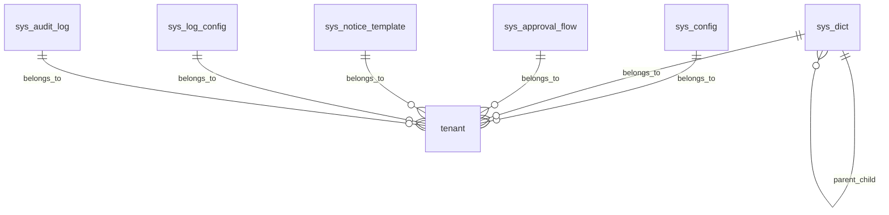

# 系统配置模块 - 数据库设计

## 概述
系统配置模块负责管理系统的全局配置参数、字典数据、审批流程、通知模板、日志配置等核心配置信息。本设计文档描述相关数据库表结构、字段定义、索引及关系。

## 设计原则
1. **可扩展性**：支持动态添加配置项，无需修改代码
2. **多租户支持**：所有配置表包含租户ID字段，支持多租户隔离
3. **版本控制**：关键配置支持版本管理，便于回滚和审计
4. **高性能**：高频查询的配置项使用缓存机制

## 数据库表设计

### 1. 系统参数配置表 (sys_config)
| 字段名 | 类型 | 长度 | 可空 | 默认值 | 说明 |
|--------|------|------|------|--------|------|
| id | bigint | | 否 | 自增 | 主键ID |
| tenant_id | varchar | 32 | 否 | | 租户ID |
| config_key | varchar | 100 | 否 | | 配置键（唯一） |
| config_value | text | | 是 | | 配置值（JSON格式） |
| config_type | varchar | 20 | 否 | 'STRING' | 配置类型：STRING/NUMBER/BOOLEAN/JSON |
| module | varchar | 50 | 否 | 'SYSTEM' | 所属模块：SYSTEM/USER/ALERT/REPORT等 |
| description | varchar | 500 | 是 | | 配置说明 |
| is_sensitive | tinyint | | 否 | 0 | 是否敏感信息（0-否，1-是） |
| is_system | tinyint | | 否 | 0 | 是否系统级配置（0-用户，1-系统） |
| version | int | | 否 | 1 | 配置版本 |
| created_by | varchar | 32 | 否 | | 创建人 |
| created_time | datetime | | 否 | CURRENT_TIMESTAMP | 创建时间 |
| updated_by | varchar | 32 | 是 | | 更新人 |
| updated_time | datetime | | 是 | | 更新时间 |

**索引**：
- 唯一索引：uniq_tenant_config (tenant_id, config_key)
- 普通索引：idx_module (module)
- 普通索引：idx_created_time (created_time)

### 2. 字典数据表 (sys_dict)
| 字段名 | 类型 | 长度 | 可空 | 默认值 | 说明 |
|--------|------|------|------|--------|------|
| id | bigint | | 否 | 自增 | 主键ID |
| tenant_id | varchar | 32 | 否 | | 租户ID |
| dict_type | varchar | 50 | 否 | | 字典类型（如：gender, status, priority） |
| dict_code | varchar | 50 | 否 | | 字典编码 |
| dict_name | varchar | 100 | 否 | | 字典名称 |
| dict_value | varchar | 500 | 是 | | 字典值 |
| sort_order | int | | 否 | 0 | 排序号 |
| parent_id | bigint | | 是 | | 父级字典ID（支持树形结构） |
| is_system | tinyint | | 否 | 0 | 是否系统字典（0-用户，1-系统） |
| status | tinyint | | 否 | 1 | 状态：0-禁用，1-启用 |
| remark | varchar | 500 | 是 | | 备注 |
| created_by | varchar | 32 | 否 | | 创建人 |
| created_time | datetime | | 否 | CURRENT_TIMESTAMP | 创建时间 |

**索引**：
- 唯一索引：uniq_tenant_dict (tenant_id, dict_type, dict_code)
- 普通索引：idx_parent_id (parent_id)
- 普通索引：idx_status (status)

### 3. 审批流程配置表 (sys_approval_flow)
| 字段名 | 类型 | 长度 | 可空 | 默认值 | 说明 |
|--------|------|------|------|--------|------|
| id | bigint | | 否 | 自增 | 主键ID |
| tenant_id | varchar | 32 | 否 | | 租户ID |
| flow_code | varchar | 50 | 否 | | 流程编码（唯一） |
| flow_name | varchar | 100 | 否 | | 流程名称 |
| business_type | varchar | 50 | 否 | | 业务类型：LEAVE/EXPENSE/PURCHASE等 |
| flow_version | int | | 否 | 1 | 流程版本 |
| flow_config | json | | 否 | | 流程配置（JSON格式，包含节点、条件、审批人规则） |
| is_active | tinyint | | 否 | 1 | 是否激活：0-停用，1-启用 |
| start_time | datetime | | 是 | | 生效时间 |
| end_time | datetime | | 是 | | 失效时间 |
| created_by | varchar | 32 | 否 | | 创建人 |
| created_time | datetime | | 否 | CURRENT_TIMESTAMP | 创建时间 |

**索引**：
- 唯一索引：uniq_tenant_flow (tenant_id, flow_code, flow_version)
- 普通索引：idx_business_type (business_type)
- 普通索引：idx_is_active (is_active)

### 4. 通知模板表 (sys_notice_template)
| 字段名 | 类型 | 长度 | 可空 | 默认值 | 说明 |
|--------|------|------|------|--------|------|
| id | bigint | | 否 | 自增 | 主键ID |
| tenant_id | varchar | 32 | 否 | | 租户ID |
| template_code | varchar | 50 | 否 | | 模板编码（唯一） |
| template_name | varchar | 100 | 否 | | 模板名称 |
| notice_type | varchar | 20 | 否 | | 通知类型：EMAIL/SMS/WECHAT/IN_APP |
| title_template | varchar | 500 | 是 | | 标题模板（支持变量） |
| content_template | text | | 否 | | 内容模板（支持变量） |
| variables | json | | 是 | | 变量定义（JSON数组） |
| is_html | tinyint | | 否 | 0 | 是否HTML格式：0-文本，1-HTML |
| status | tinyint | | 否 | 1 | 状态：0-禁用，1-启用 |
| created_by | varchar | 32 | 否 | | 创建人 |
| created_time | datetime | | 否 | CURRENT_TIMESTAMP | 创建时间 |

**索引**：
- 唯一索引：uniq_tenant_template (tenant_id, template_code)
- 普通索引：idx_notice_type (notice_type)
- 普通索引：idx_status (status)

### 5. 日志配置表 (sys_log_config)
| 字段名 | 类型 | 长度 | 可空 | 默认值 | 说明 |
|--------|------|------|------|--------|------|
| id | bigint | | 否 | 自增 | 主键ID |
| tenant_id | varchar | 32 | 否 | | 租户ID |
| module | varchar | 50 | 否 | | 模块名称 |
| log_level | varchar | 10 | 否 | 'INFO' | 日志级别：DEBUG/INFO/WARN/ERROR |
| retention_days | int | | 否 | 30 | 保留天数 |
| storage_type | varchar | 20 | 否 | 'LOCAL' | 存储类型：LOCAL/CLOUD/ELK |
| config_json | json | | 是 | | 详细配置（JSON格式） |
| is_enabled | tinyint | | 否 | 1 | 是否启用：0-禁用，1-启用 |
| created_by | varchar | 32 | 否 | | 创建人 |
| created_time | datetime | | 否 | CURRENT_TIMESTAMP | 创建时间 |

**索引**：
- 唯一索引：uniq_tenant_module (tenant_id, module)
- 普通索引：idx_log_level (log_level)

### 6. 审计日志表 (sys_audit_log)
| 字段名 | 类型 | 长度 | 可空 | 默认值 | 说明 |
|--------|------|------|------|--------|------|
| id | bigint | | 否 | 自增 | 主键ID |
| tenant_id | varchar | 32 | 否 | | 租户ID |
| user_id | varchar | 32 | 否 | | 用户ID |
| username | varchar | 100 | 否 | | 用户名 |
| operation | varchar | 50 | 否 | | 操作类型：CREATE/UPDATE/DELETE/QUERY |
| module | varchar | 50 | 否 | | 模块名称 |
| table_name | varchar | 50 | 是 | | 表名 |
| record_id | varchar | 100 | 是 | | 记录ID |
| old_value | json | | 是 | | 旧值（JSON格式） |
| new_value | json | | 是 | | 新值（JSON格式） |
| ip_address | varchar | 50 | 是 | | IP地址 |
| user_agent | varchar | 500 | 是 | | 用户代理 |
| operation_time | datetime | | 否 | CURRENT_TIMESTAMP | 操作时间 |
| status | tinyint | | 否 | 1 | 操作状态：0-失败，1-成功 |
| error_message | text | | 是 | | 错误信息 |

**索引**：
- 普通索引：idx_tenant_user (tenant_id, user_id)
- 普通索引：idx_operation_time (operation_time)
- 普通索引：idx_module_operation (module, operation)

## 数据库关系图


## 缓存策略
1. **系统参数缓存**：使用Redis缓存，key格式：`config:{tenant_id}:{config_key}`，过期时间5分钟
2. **字典数据缓存**：按字典类型缓存，key格式：`dict:{tenant_id}:{dict_type}`，过期时间10分钟
3. **审批流程缓存**：流程配置缓存，key格式：`flow:{tenant_id}:{flow_code}:{version}`，过期时间30分钟

## 数据初始化脚本
```sql
-- 系统默认配置
INSERT INTO sys_config (tenant_id, config_key, config_value, config_type, module, description) VALUES
('default', 'system.name', 'NESOM运维管理系统', 'STRING', 'SYSTEM', '系统名称'),
('default', 'system.version', '1.0.0', 'STRING', 'SYSTEM', '系统版本'),
('default', 'system.logo.url', '/static/logo.png', 'STRING', 'SYSTEM', '系统Logo地址');

-- 默认字典数据
INSERT INTO sys_dict (tenant_id, dict_type, dict_code, dict_name, dict_value, sort_order, is_system) VALUES
('default', 'gender', 'MALE', '男', '1', 1, 1),
('default', 'gender', 'FEMALE', '女', '2', 2, 1),
('default', 'status', 'ENABLED', '启用', '1', 1, 1),
('default', 'status', 'DISABLED', '禁用', '0', 2, 1);

-- 默认通知模板
INSERT INTO sys_notice_template (tenant_id, template_code, template_name, notice_type, title_template, content_template) VALUES
('default', 'USER_REGISTER', '用户注册通知', 'EMAIL', '欢迎注册NESOM系统', '尊敬的{username}，欢迎注册NESOM运维管理系统。');
```

## 维护与优化建议
1. 定期清理审计日志，根据retention_days配置自动删除过期日志
2. 监控系统参数表数据量，避免过多配置项影响查询性能
3. 对高频查询的字典数据建立合适的索引和缓存
4. 审批流程配置变更时，需同步更新缓存并通知相关服务

---
*最后更新：2026-04-02*